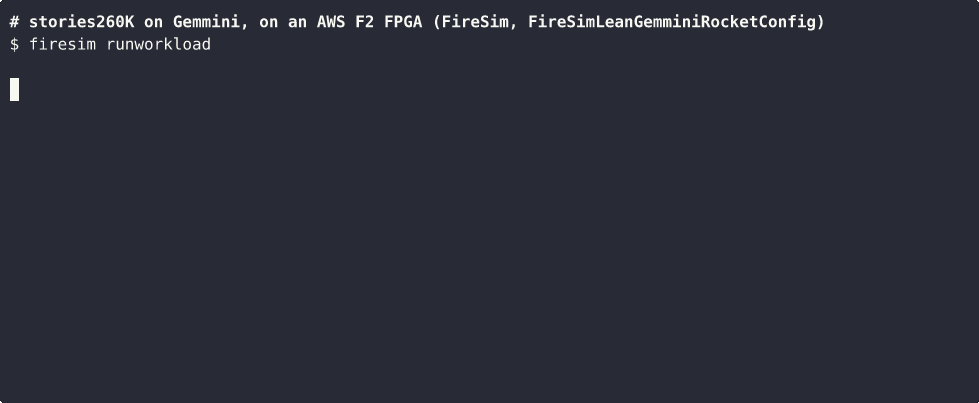
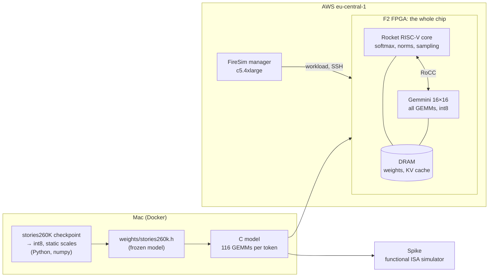
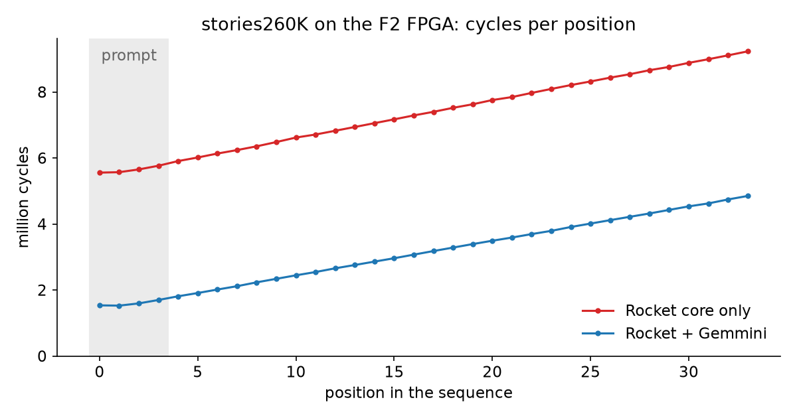
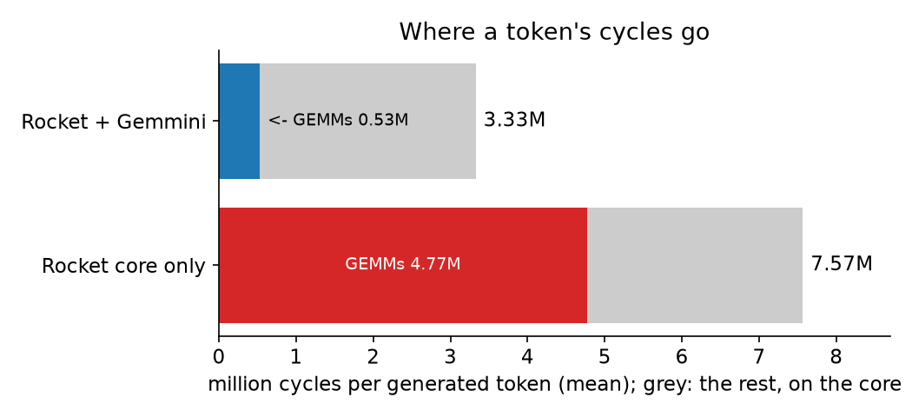
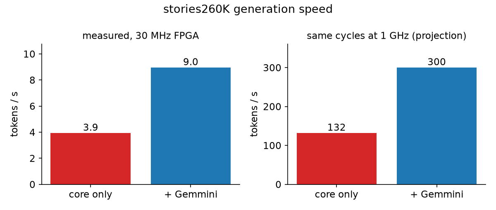
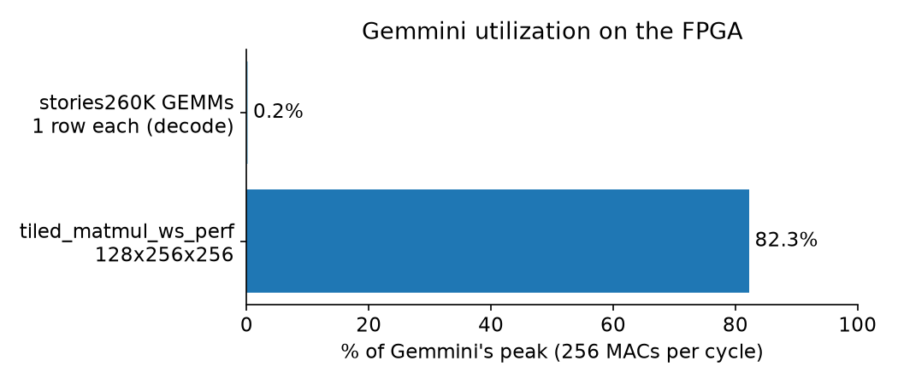
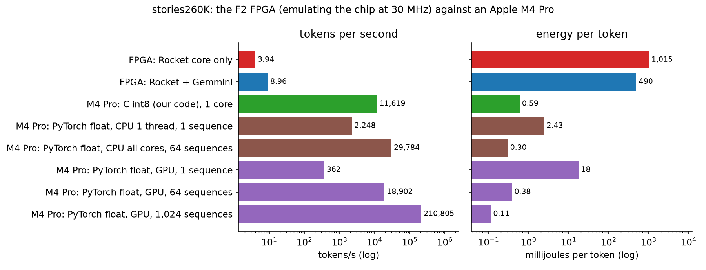
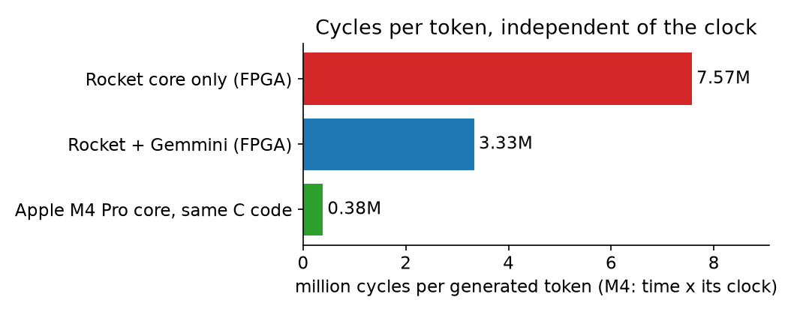

<!-- Generated by llm/tools/report.py from REPORT.md.in: edit those, not this file. -->
# An LLM on an open-source accelerator, on a real FPGA

*OpenASDx, hackathon "Towards an Open-Source GPU for Science", 2026-09-26*

## Summary

We ran a small language model on a real FPGA, with every matrix multiplication (GEMM) of the model executed by **Gemmini**. Gemmini is the open-source systolic-array accelerator from UC Berkeley, and it is attached to an open-source RISC-V core (Rocket). The chip runs on an **AWS F2 FPGA** through FireSim, in Frankfurt.

- **It works, and it's exact.** The model is stories260K. We ran all 3,944 GEMMs of a generation on Gemmini and on the CPU side by side, and they are **bit-identical**. The tokens are the same on the FPGA, on the Spike simulator and on a Mac.
- **It's faster.** A token takes **3.33M cycles with Gemmini, against 7.57M on the RISC-V core alone**. That's 2.3× end to end, and about 9× on the GEMMs themselves. At the FPGA's 29.8 MHz, that's **9.0 tokens/s against 3.9**.
- **The hardware is sound.** Every Gemmini bare-metal test within the prebuilt image's features passes on the FPGA (15 of 20), and a large matmul reaches **82% of peak**.
- **Against a laptop:** one core of an Apple M4 Pro runs the same C code 1,296× faster, mostly thanks to its clock, and at about 828× less energy per token than the FPGA, which is emulating the chip. Its GPU wins only with 1,024 sequences at once (see "Against a laptop").
- **The bottleneck is now software.** With Gemmini doing the GEMMs, 84% of a token's cycles go to work on the core, and the GEMMs use only 0.2% of Gemmini's peak, because decoding multiplies one vector at a time. Both problems have known fixes, listed under "What's next".

Prompt: **"Once upon a time"**. What the model wrote on the FPGA:

> Once upon a time, there was a little girl named Lily. She loved to play outside in the park. One day,

### The demo



This is a live recording of the FPGA run (idle pauses shortened to 2 s). The chip prints each word through its UART as soon as it has chosen it. The words arrive faster at first and slower later, because each position costs more than the one before it (see "Speed"). This run generates 100 tokens instead of 30, at 7.0M cycles per token on average, which is 4.2 tokens/s at 30 MHz. The console log is in `llm/fpga/f2/results/demo/`, and `img/demo/README.md` explains how it was recorded.

**The interactive demo.** Here you type the start of a story, and the chip continues it. The chip reads the prompt through its UART, tokenizes it itself (llama2.c's BPE, ported to C and checked against the Python tokenizer by `make -C llm test-encoder`), and generates with every GEMM on Gemmini. Each prompt starts a new story. In this recording, a script types the two prompts. `aws/manager/fpga-chat.sh` gives you the same session to type into yourself.


## What we built



1. **The model.** We trained nothing: we took stories260K, a pretrained Llama-style model with 260,032 parameters trained on TinyStories (karpathy/tinyllamas, MIT). Its shape: dim 64, 5 layers, 8 query heads and 4 KV heads, vocabulary 512.
2. **Quantization to Gemmini's contract.** The prebuilt FPGA image can't read int32 results out of the accelerator, so every GEMM has to end in int8: `q = clamp(round(acc × scale), −128, 127)`. We calibrated one static output scale per GEMM type, 46 in total, from a float pass over 4 prompts. Then we froze the model as a C header (`llm/weights/stories260k.h`).
3. **A C implementation** in which every matmul goes through one function, `backend_gemm_i8_o8`. Its backends:
   - the CPU;
   - Gemmini;
   - a checked backend, which runs both and compares every output element.
4. **Spike first.** The bare-metal RISC-V binary ran on Spike with the Gemmini extension. The GEMMs were bit-identical and the tokens matched.
5. **The same binary on the FPGA.** On AWS we set up:
   - a FireSim manager;
   - an F2 loaded with FireSim's public Gemmini image;
   - a one-command runner.

   Then we ran the model and Gemmini's own tests.

Everything is reproducible from the repo: `docker/`, `llm/` and `aws/`.

### Terms

- **Spike** is the reference RISC-V instruction-set simulator. It runs a RISC-V program on an ordinary computer (here, the Mac or the manager) and executes one instruction after another, exactly as the ISA specifies. The Gemmini extension (`libgemmini`) adds Gemmini's custom instructions. Spike is fast (a whole model run takes under 2 s) and checks that the program computes the right results. But it models no hardware: it has no pipeline, no memory latency, and no systolic array doing work cycle by cycle, so the "cycles" it reports are only instruction counts. We used it to check the software before the FPGA. Every cycle count in this report comes from the FPGA.
- **FireSim** takes the RTL (the actual hardware design) of a whole chip and runs it on an FPGA, cycle by cycle, at tens of MHz. A program on it behaves exactly as it would on the real chip, so cycle counts are real hardware numbers. The FPGA's 30 MHz only sets how fast the simulation runs, not the cycle counts.
- **Gemmini** is the matrix-multiplication accelerator: a 16×16 grid of int8 multiply-accumulate units (a systolic array) with its own on-chip memory. It is attached to the core as a RoCC coprocessor, and the core drives it with custom RISC-V instructions.
- **Rocket** is the RISC-V CPU core that runs the program. It does everything that isn't a matrix multiplication.
- **GEMM** is a general matrix multiplication, C = A × B. In this model, every linear layer and both attention products are GEMMs.
- **ELF** is the program file: the compiled RISC-V binary with its code, the frozen weights and the space reserved for buffers. Spike and FireSim both load the same ELF.
- **Lean config** is the Gemmini configuration in FireSim's prebuilt F2 image. Its limits are listed under "The platform".

## Results

### Correctness

| check | result |
|---|---|
| GEMM outputs, Gemmini against the CPU (3,944 GEMMs, 34 positions) | **bit-identical** on the FPGA and on Spike |
| tokens: FPGA, Spike and Mac | identical |
| tokens against the float64 Python reference | first 16 of 30 identical (23 of 30 overall)¹ |
| quality of the int8 model, perplexity on a held-out text of 125 tokens | float 2.46 → int8 with int32 read-out 2.49 → Lean int8 2.51 |
| top-1 agreement with the float model | 96.8% with int32 read-out, 95.2% with Lean int8 |

¹ After 23 matching tokens, the top two logits are within one int8 output step of each other. float32 in C and float64 in Python round that near-tie differently, and the text continues differently from there, still fluently. Details are in `llm/weights/TASK.md`.

### Speed



Every position costs more than the one before it, about 105k cycles more with Gemmini and 115k more without. The attention reads the growing KV cache. The GEMMs over that cache grow by only 640 MACs per position, so the growth is almost all the core re-quantizing and repacking the cache at every step.



| per generated token, mean over 30 tokens | Rocket core only | Rocket + Gemmini |
|---|---:|---:|
| cycles | 7,568,014 | **3,328,496** |
| of which in GEMM calls | 63% (≈ 4.77M) | 16% (≈ 0.53M) |
| **tokens/s at 29.8 MHz (measured)** | 3.9 | **9.0** |
| tokens/s at 1 GHz (same cycles, projection) | 132 | 300 |
| speedup, end to end / GEMMs only | | **2.3× / ≈ 9×** |



The cycle counts come from the core's `rdcycle` counter. They are cycles of the actual RTL, so they don't depend on the FPGA's clock. The 1 GHz column only rescales them to show what a clock typical of a real chip would give. It is not a measurement. The GEMM shares are the rounded percentages the binary prints, so the GEMM-only speedup is about 9×.

### Compute

| | per generated token |
|---|---:|
| int8 MACs (all 116 GEMMs, mean over the 30 generated tokens) | **271,808** |
| of which the fixed projections and the LM head | 259,328 |
| of which attention over the cache | 640 × (position + 1) |
| operations, counting a MAC as 2 | 0.54 MOP (int8) |

| throughput | Rocket core only | Rocket + Gemmini |
|---|---:|---:|
| MACs per cycle inside the GEMMs | 0.057 | 0.51 |
| end to end at 29.8 MHz | 1.1 MMAC/s | 2.4 MMAC/s |

The peak of Gemmini's Lean 16×16 array is 256 MACs per cycle, which is 7.6 GMAC/s at 29.8 MHz.



**Gemmini's numbers against the model's.** A large matmul (`tiled_matmul_ws_perf`, 128×256×256) runs at **82% of peak** on the FPGA. The model's GEMMs run at **0.2%**. In decode, each GEMM multiplies a single row (M = 1) by a small matrix, so 15 of the array's 16 rows sit idle. Each of the 116 calls per token also pays a fixed cost to configure the accelerator, move the weights in and wait for the result, about 4,591 cycles on average. That's what batching and keeping the weights on chip would fix.

### Memory

The whole program, with the model, the KV cache and the buffers, takes **1.3 MB of the chip's DRAM**. The program is one ELF file, the compiled RISC-V binary that FireSim loads into the chip's memory and runs. Its size, section by section:

| | bytes | notes |
|---|---:|---|
| int8 weights (all GEMMs) | 259,328 | read once per token |
| float embeddings and norms | 133,888 | |
| KV cache, allocated | 655,360 | float, for the full context of 512 tokens |
| KV cache, used by the 34-position run | 43,520 | |
| Gemmini staging buffers | 181,248 | padded A and B, the accumulator, the int8 path's A, B and C |
| code | 18,414 | |
| **total ELF image (`riscv64-unknown-elf-size`)** | **1,301,191** | `.rodata` 396,313, `.bss` 885,832 |

Gemmini has 320 KB of on-chip memory: a 256 KB scratchpad and a 64 KB accumulator. The int8 weights are 259 KB, just over the scratchpad, so every token streams them from DRAM again. At 9.0 tokens/s, that's only about 2.3 MB/s. The problem isn't bandwidth but the per-call overhead described above.

We didn't measure the FPGA resources (LUTs, BRAM): the image is FireSim's prebuilt `agfi-0f567000cb21cb06d`, and we didn't synthesize it.

### FPGA power

The F2 reports the power of its FPGA's core supply rail (Vccint) in whole watts (`fpga-describe-local-image -M`). We sampled it about once a second during three runs (278 readings, `llm/fpga/f2/results/power/`), and matched the samples to each run by the start and end times in its console log.

| phase | FPGA core power |
|---|---:|
| slot cleared, no image loaded | 9 W |
| Gemmini image loaded, idle | 3 W |
| demo run (100 tokens) | 4.9 W |
| stories260K, Gemmini build | 4.4 W |
| stories260K, Rocket core only | 4.0 W |

- **With a run on it, the FPGA core draws about 4–5 W**, 1 to 2 W more than when it's loaded and idle.
- **The readings can't tell Gemmini working apart from the core alone.** The differences between the runs are less than one reading step, and they follow the readings' steady drift downwards over the session. The cleared slot draws more than a loaded image, probably from the default image a cleared FPGA holds.
- **Energy per token for the emulator's core rail:** about 0.49 J with Gemmini and 1.01 J without, the power times the time per token at the FPGA's clock. Gemmini saves energy here mostly because a token takes less time, not because the power changes.

This is the power of an FPGA emulating the chip, not of a Gemmini chip. An FPGA spends many LUTs and routing on each gate of the design, and it runs at 30 MHz. A chip built from the same RTL would use far less energy per token. The rail also leaves out the FPGA card's DRAM and I/O, and the F2's host CPU.

### Gemmini's own tests on the FPGA

We ran 20 bare-metal tests: **15 pass, which is every test within the Lean image's features**. The other 5 need features the image leaves out, and the model uses none of them:

| needs | tests |
|---|---|
| a bias matrix D | `matmul_ws`, `padded`, `raw_hazard` |
| int32 read-out | `tiled_matmul_ws_full_C` |
| output-stationary dataflow | `transpose`, `padded`, `raw_hazard` |

| perf test | Gemmini cycles | |
|---|---:|---|
| `tiled_matmul_ws` 64×64×64 | 2,597 | against 3,240,505 on the Rocket core: about 1,248× |
| `tiled_matmul_ws_perf` 128×256×256 | 39,815 | 82% of the ideal 32,768 |
| `conv_perf` batch 4, 224×224×3 → 32, 3×3, stride 2 | 1,862,456 | |
| `conv_dw_perf` depthwise, batch 3, 112×112×17, 3×3, stride 2 | 2,529,093 | |

Details and every console log: `llm/fpga/f2/FIRESIM.md` and `llm/fpga/f2/results/`.

## Against a laptop: Apple M4 Pro

The same model and prompt, with 30 new tokens, on this team's laptop, an Apple M4 Pro:
- **our C int8 code**, the same as on the FPGA, on one CPU core;
- **PyTorch in float32**, on the CPU and on the GPU (Metal), with one sequence or a batch.

Each run lasted 20 s, with the power sampled every 200 ms by macOS' `powermetrics` (`llm/bench/mac-power.sh`). The results are in `llm/bench/results/mac/`. The C build gives exactly the FPGA's tokens, and PyTorch matches the numpy float reference on all 30 (`tools/bench_torch.py --check`).

| system | tokens/s | power while running | energy per token |
|---|---:|---:|---:|
| C int8 (our code), 1 core | 11,619 | 6.9 W (CPU 6.9, GPU 0.0) | 0.59 mJ |
| PyTorch float, CPU 1 thread, 1 sequence | 2,248 | 5.5 W (CPU 5.5, GPU 0.0) | 2.43 mJ |
| PyTorch float, CPU all cores, 64 sequences | 29,784 | 8.9 W (CPU 8.9, GPU 0.0) | 0.30 mJ |
| PyTorch float, GPU, 1 sequence | 362 | 6.4 W (CPU 6.3, GPU 0.1) | 17.72 mJ |
| PyTorch float, GPU, 64 sequences | 18,902 | 7.2 W (CPU 6.3, GPU 0.9) | 0.38 mJ |
| PyTorch float, GPU, 1,024 sequences | 210,805 | 23.8 W (CPU 4.3, GPU 19.5) | 0.11 mJ |
| **FPGA: Rocket + Gemmini** | 9.0 | 4.4 W, FPGA core rail | 0.49 J |
| FPGA: Rocket core only | 3.9 | 4.0 W, FPGA core rail | 1.01 J |



What the numbers say:
- **One M4 core runs our code 1,296× faster than the FPGA**, at 11,619 tokens/s (86 µs per token). Most of that is the clock: 4.4 GHz against 30 MHz. Per cycle, the M4 core needs about 0.38M cycles per token (its time per token × its clock), which is 20× fewer than Rocket and 9× fewer than Rocket + Gemmini. The M4 is a wide out-of-order core with vector units, and Rocket is a small in-order core.
- **The GPU only pays off with many sequences at once.** For one sequence, it's the slowest system on the Mac (362 tokens/s, 32× slower than the C code), because each token launches hundreds of tiny GPU kernels. With 1,024 sequences, it reaches 210,805 tokens/s, 18× the C code, at 0.11 mJ per token, the lowest energy per token of all (24 W for the whole chip).
- **The FPGA uses about 828× more energy per token than one M4 core.** That's expected, and it isn't Gemmini's efficiency: the FPGA emulates the chip, spending many LUTs and wires on each gate, at 30 MHz. A chip built from the same RTL would be far faster and far more efficient. We have no measurement of that, so we don't give a number.



Caveats:
- The Mac's power is `powermetrics`' estimate for the CPU and GPU. It leaves out the memory, the display and the rest of the laptop. The idle Mac, measured just before, drew 43 mW, which is negligible here.
- The FPGA's power is its core rail only.
- C int8 and PyTorch float don't do the same arithmetic, so they give different tokens after a while. The C code is the one that computes exactly what the FPGA computes.
- The M4's cycles per token assume the busiest core's average clock during the run. The thread moves between cores, so it's an estimate.

## The platform

| | |
|---|---|
| FPGA | AWS f2.6xlarge, 1 FPGA, `eu-central-1b` (Frankfurt; the data stays in the EU) |
| image | FireSim `firesim_gemmini_rocket_singlecore_no_nic`, `agfi-0f567000cb21cb06d`, public and prebuilt |
| chip | `FireSimLeanGemminiRocketConfig`: one Rocket core and Gemmini, at 30 MHz (measured: 29.8 MHz) |
| Gemmini | 16×16 int8 array, 256 KB scratchpad, 64 KB accumulator, weight-stationary dataflow, int8 read-out |
| software | Chipyard 1.14.0 (`0acc1e1`), AWS FPGA Developer AMI (Ubuntu) 1.19.2, riscv64-unknown-elf-gcc 13.2.0 |
| manager | c5.4xlarge (no FPGA), which builds and drives the runs |
| wall clock | one model run takes about 32 s on the FPGA, and 95 s with setup and flashing. Spike takes 1.3 s (Gemmini only) to 1.8 s (checked) |

We chose the prebuilt image over building our own bitstream, which takes several hours (#34). The price is the Lean config's limits, and we designed the int8-out contract around them.

## What we did, in order

1. **Dev environment.** Docker for Chipyard, Spike and Gemmini on Apple Silicon (#30). A fresh build takes 19 minutes, and `docker/dev.sh check` runs Gemmini's tests on Spike.
2. **The GEMM interface.** The list of every matmul in the model (#32), and one backend function for all of them.
3. **The FPGA path** (#34): FireSim with the public Lean Gemmini image in Frankfurt. The alternative, a custom HDK register GEMM, stays parked as a backup.
4. **The model** (#38 to #42): an off-the-shelf model instead of training. We checked stories260K's quality under the Lean int8 contract, exported it to int8 with static scales, froze it, and ported it to C.
5. **Spike** (#44): stories260K bare-metal, with every GEMM on Gemmini, bit-identical to the CPU.
6. **AWS** (#45 and #46), within a shared account with a tag-based IAM policy:
   - scripts to launch and set up the manager and the F2;
   - SSH on port 443 for networks that block port 22;
   - fixes for the AMI: the conda solver, a glibc lock-file patch, a login shell for Vivado, pyOpenSSL for the `aws` CLI;
   - start, stop and status scripts.
7. **The FPGA** (#47):
   - FireSim set up with the F2 as an externally provisioned run host;
   - the model on the FPGA, bit-exact;
   - cycles per token with and without Gemmini;
   - 20 of Gemmini's tests.

## Questions and answers

**Does the whole model run on the FPGA, or only the parts that fit in Gemmini?** The whole model. The FPGA holds a complete RISC-V chip: Gemmini does all 116 matrix multiplications per token, and the Rocket core next to it does everything else (int8 quantization of the activations, RMSNorm, RoPE, softmax, the KV cache, SwiGLU, choosing the next token). The weights, the KV cache and the activations live in the chip's memory, which is the DRAM on the FPGA card. The F2's x86 host only loads the program and relays the console. Gemmini doesn't have to hold the model: it streams each weight matrix in from the chip's memory for each GEMM.

**How does attention work?** For each of the 5 layers and 8 heads, at each position:
1. Gemmini computes the projections q, k and v.
2. The core applies RoPE, and appends k and v to the KV cache.
3. Gemmini computes the scores q·Kᵀ over every cached position (one GEMM).
4. The core scales them by 1/√d and applies the softmax.
5. Gemmini computes probabilities × V (a second GEMM), and then the output projection.

The 8 query heads share 4 KV heads (grouped-query attention). Before each GEMM, the core quantizes the inputs to int8, which for attention means the whole cached K and V at every position. That's the main cost outside the GEMMs.

**Where do the weights come from, and how do they get onto the FPGA?**
1. The float checkpoint is karpathy/tinyllamas' `stories260K.bin`, trained on TinyStories.
2. `llm/tools/export_stories.py` quantized it once to int8, and froze it as C arrays in `llm/weights/stories260k.h`, whose SHA-256 is in `llm/weights/TASK.md`.
3. The compiler puts those arrays into the program (the ELF).
4. `firesim infrasetup` copies the ELF to the F2's host.
5. At the start of a run, the FireSim driver writes it into the chip's memory on the FPGA card, over the chip's debug link.

From then on, nothing comes from outside until the text goes out through the UART.

**How can a 30 MHz chip be this fast?** The model is tiny: 271,808 MACs per token, against about 124M for GPT-2 small and 7 billion for a 7B-parameter model. At 30 MHz, Gemmini's peak is 7.6 GMAC/s, enough in theory for tens of thousands of tokens/s of this model. We reach 9.0 tokens/s, 0.2% of that peak (see "Compute"). With a GPT-2-sized model, the same chip would take minutes per token.

**How do we know it's the FPGA doing the work?**
- The chip's own cycle counter matches the wall clock at the FPGA's speed: the demo ran 776M cycles in 26.0 s, which is 29.8 MHz.
- Every log names the loaded FPGA image and its PCI device.
- The Gemmini tests that fail are exactly those that need features this image leaves out.
- In the checked build, every GEMM result from Gemmini matches the core's bit for bit.

**Is the output the same everywhere?** The FPGA, Spike and the same C code on the Mac give identical tokens: all 30 of the test, and all 100 of the demo. The numpy reference (float64, same int8 contract) matches the first 23 of 30, then diverges at a near-tie (footnote ¹). Against the unquantized float model, the int8 model picks the same next token 95.2% of the time.

**Is there a GPU anywhere?** No. The F2 has an x86 host CPU and the FPGA card, and the model runs on the FPGA. Nothing simulates the FPGA: it's the real hardware, programmed with our chip's design.

## Conclusions

1. **An open-source hardware stack can run an LLM end to end.** Every piece is open: the RISC-V core, the accelerator, the SoC generator and the FPGA simulation framework. The same RISC-V binary runs on a functional simulator and on a real FPGA, with identical results.
2. **Integer accelerators work for LLM inference without retraining.** A static int8 calibration of an off-the-shelf model costs 0.04 of perplexity and keeps 95.2% of top-1 choices, even with the strictest read-out (int8 out).
3. **Checking bit for bit is cheap and catches real bugs.** Running every GEMM on both backends in the same binary found a sign-of-zero mismatch that comparing tokens would have missed.
4. **For decoding, the accelerator isn't the bottleneck.** The GEMMs speed up 9×, but the whole model only 2.3×, because what's left on the core (the cache handling, softmax and norms) now dominates. Gemmini itself runs at 0.2% of peak on one-row GEMMs, against 82% on a large matmul. Batch-1 decode on a systolic array is limited by per-call overhead and by the shape of the matrices, not by compute.

## What's next

In order of expected gain:

1. **Keep the KV cache in int8.** The core then stops re-quantizing the whole cache at every position. This should remove most of the 2.80M cycles per token spent outside the GEMMs.
2. **Batch sequences** (M up to 16) to fill the array's rows, or fuse the GEMMs that share an input: Q, K and V into one, and W1 and W3 into another.
3. **Keep the weights on chip.** Pin the most-used layers in the scratchpad, instead of moving them in on every call.
4. **A bigger model** (#21) and the full Gemmini config (#10: int32 read-out, 110 MHz), for numbers closer to a real workload.
5. **The rest of Gemmini's tests** on the FPGA (#11), and a cycle-accurate RTL run in Verilator (#25).

## Reproduce

```shell
make -C llm test-stories                 # the model in C on the Mac
docker/dev.sh check                      # Gemmini's tests on Spike (docker/README.md)
make -C llm test-spike                   # stories260K on Spike, every GEMM checked
# FPGA: aws/README.md sets up the manager and the F2, then, on the manager:
bash ~/fpga-batch.sh llm-stories-gemmini-baremetal llm-stories-cpu-baremetal
llm/tools/.venv/bin/python llm/tools/report.py          # this report, its numbers and charts
```
